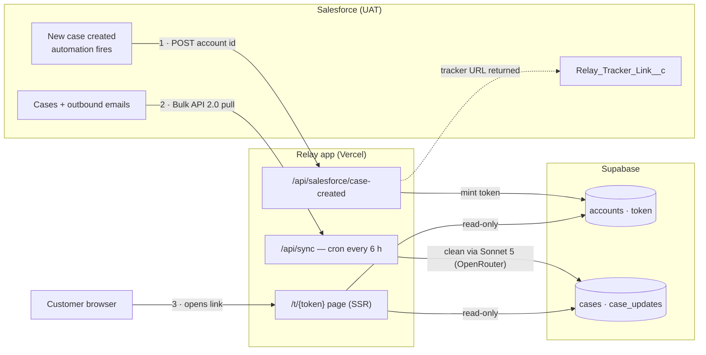

# Relay

Customer-facing support-ticket status pages for FieldPulse — replacing the per-customer Excel
trackers CS maintained by hand. Every Salesforce Account gets **one permanent, unguessable link**
(`/t/{token}`) showing its open tech-support tickets, status, and a cleaned "latest update" per
ticket. Public page, no login; the link itself is the credential.

**Linear:** [Relay project](https://linear.app/fieldpulse/project/relay-e7e7451fa6f8) ·
**Architecture deep-dive:** `../docs/relay-backend-architecture.md`

## How it works — three independent flows



**1 · New case → link (instant, event push).** A Salesforce automation fires on case creation and
POSTs the account id to `/api/salesforce/case-created`. We upsert the account and mint a permanent
token (**one per account, not per case** — idempotent: the same account always gets the same link)
and return `{ trackerUrl }`. The SF automation writes that URL to `Relay_Tracker_Link__c` on the
Account. This is the **only** way an account enters Relay.

**2 · Data refresh (pull, every 6 h).** Vercel Cron calls `/api/sync`, which pulls case statuses +
each case's newest outbound email via **Salesforce Bulk API 2.0** (submit query job → poll →
download CSV — deliberately off the org's strained REST quota), runs each update through a Claude
Sonnet 5 clean + public-safety pass (via OpenRouter), and upserts into Supabase. It only queries
cases for accounts already tracked.

**3 · Customer visit.** `/t/{token}` renders server-side from **Supabase only** — Salesforce is
never touched at page load, so pages are fast, put zero load on the SF org, and survive an SF
outage. Unknown token → 404 (fails closed).

## Scope invariants — do not relitigate these

| Rule | Why |
|---|---|
| **Strict event-only. No backfill.** Accounts enter Relay only via the case-created endpoint; the sync is scoped to already-tracked accounts and can never create one. | Deliberate go-forward scope decision (not a gap). An unfiltered sync would mass-mint links for ~370 existing accounts. |
| **Relay is read-only against Salesforce.** The single SF write (`Relay_Tracker_Link__c`) is done by the SF automation, not by this app. | Keeps our integration surface minimal and the write path auditable on the SF side. |
| **Fail closed on content.** Cleaner error, model refusal, unparseable output, or sensitive content → generic fallback line. Raw email text never renders. | The page is public; this is the safety model (Claude safety pass, IAI-214). |
| **No client-side data access.** RLS enabled with zero policies; only the server-side service-role key can read/write. The browser gets finished HTML. | An unguessable link is the only credential — the data plane must not be reachable any other way. |

## Repo map

| Path | What it is |
|---|---|
| `app/t/[token]/page.tsx` | The customer status page (SSR, Supabase-only reads, 404 on bad token) |
| `app/api/sync/route.ts` | Sync trigger — GET (cron) + POST (manual, 10-min cooldown) |
| `app/api/salesforce/case-created/route.ts` | New-case webhook: upsert account, mint token, return link |
| `lib/salesforce.ts` | Bulk API 2.0 client: OAuth client-credentials, job → poll → CSV, RFC-4180 parser |
| `lib/sync.ts` | Sync orchestration: known-accounts scope, status mapping, clean, upsert |
| `lib/status.ts` | Raw `Case.Status` → customer chip mapping |
| `lib/update-cleaner.ts` | Sonnet 5 clean + safety pass (OpenRouter); exports the safe fallback line |
| `lib/data.ts` / `lib/supabase.ts` / `lib/env.ts` | Page data loader · service-role client · fail-fast env access |
| `lib/seed.ts` · `lib/fixtures/emails.ts` | Local seed data · cleaner golden-set fixtures |
| `scripts/test-lib.ts` · `scripts/eval-cleaner.ts` | Offline fixture tests · cleaner safety eval |
| `supabase/migrations/0001_init.sql` | Schema (apply via Supabase SQL editor or CLI) |
| `vercel.json` | Registers the 6-hourly cron on deploy |

## Data model

`accounts` (one per SF Account; `token` uuid = the public slug) → `cases` (status raw + chip,
open + closed-last-30d) → `case_updates` (one per case: raw email, cleaned text, `safety_flag`) ·
`sync_runs` (one row per sync for observability + audit).

Status chips (source: Saffi's mapping, validated against live data — all statuses that actually
occur on open tech cases are covered; anything unknown falls back to `in_progress`, never leaking
a raw internal status):

| Raw `Case.Status` | Chip |
|---|---|
| Waiting for Customer | `waiting_for_you` |
| New · Waiting for Support | `waiting_for_support` |
| In Progress · Hold · Monitoring · Waiting for CS · Waiting for Sync · Waiting on Engineering | `in_progress` |
| Closed · Cannot Reproduce · Rejected · Merged | `resolved` |
| *(anything else)* | `in_progress` |

## Environment variables

Names mirror `.env.example`. Locally: `.env.local` (gitignored). Deployed: Vercel project settings.

| Variable | Purpose |
|---|---|
| `SUPABASE_URL` / `SUPABASE_SERVICE_ROLE_KEY` | Read-store access (server-side only) |
| `SF_INSTANCE_URL` / `SF_CLIENT_ID` / `SF_CLIENT_SECRET` | Connected App OAuth client-credentials for Bulk API reads |
| `SALESFORCE_INTEGRATION_KEY` | Static bearer the SF case-create automation presents to us |
| `OPENROUTER_API_KEY` | Cleaner model calls (`anthropic/claude-sonnet-5`) |
| `RELAY_SYNC_KEY` | Auth for the manual sync POST |
| `CRON_SECRET` | Vercel Cron sends `Authorization: Bearer $CRON_SECRET` on the GET — without it the scheduled sync 401s |
| `NEXT_PUBLIC_APP_URL` | Origin used to build tracker URLs (set to the real domain in prod) |
| `SLACK_ALERT_WEBHOOK_URL` | Slack incoming webhook — sync failures POST here (IAI-239). Unset = alerting no-ops |

## API

| Endpoint | Method | Auth | Behavior |
|---|---|---|---|
| `/api/sync` | GET | `Authorization: Bearer $CRON_SECRET` | Cron-triggered sync |
| `/api/sync` | POST | `x-relay-sync-key: $RELAY_SYNC_KEY` | Manual refresh; 429 if any run started < 10 min ago |
| `/api/salesforce/case-created` | POST | `Authorization: Bearer $SALESFORCE_INTEGRATION_KEY` | Body `{ "accountId": "001…", "accountName": "…" }` → `{ "trackerUrl": "https://…/t/<token>" }`. Idempotent per account. |
| `/api/health` | GET | `x-relay-sync-key: $RELAY_SYNC_KEY` | Sync health over `sync_runs` → `{ state, healthy, ageMinutes, lastRun }`. **200 healthy / 503 stale·stuck·error** — point an uptime monitor here. |

## Local development

```bash
npm install
cp .env.example .env.local   # fill in values
npm run dev
```

Degrades gracefully without creds: no Supabase → the page serves seed fixtures / unknown tokens
404; no Salesforce/OpenRouter → `/api/sync` errors cleanly and cleaner failures fall back safe.

```bash
npm run test:lib       # offline fixture tests (CSV parser, status mapping) — no creds needed
npm run eval:cleaner   # cleaner golden set — needs OPENROUTER_API_KEY; safety gate must flag 5/5
npm run typecheck
```

## Deploy & operations

**Vercel:** root directory `./`, Next.js preset, all env vars above set. The cron registers
automatically from `vercel.json` (every 6 h). `/api/sync` sets `maxDuration = 300` (requires Pro).

Manual sync (e.g. before CS shares a link):

```bash
curl -X POST https://<domain>/api/sync -H "x-relay-sync-key: $RELAY_SYNC_KEY"
```

**Observability (IAI-239).** Two failure modes, two mechanisms:
- **Explicit errors** (SF auth, Supabase, SOQL) → the sync posts a Slack alert to `SLACK_ALERT_WEBHOOK_URL`.
- **Silent timeouts** (function killed at `maxDuration`, row stuck `running`) → no code runs, so no
  alert; caught by `GET /api/health`, which returns **503** when stale/stuck/error. Point an uptime
  monitor at it (sending the `x-relay-sync-key` header) for hands-off detection.

Quick glance without the endpoint — last few runs straight from Supabase:

```sql
select started_at, finished_at, status, cases_upserted, error
from sync_runs order by started_at desc limit 5;
```

Known failure modes: OAuth 401 → Connected App client-credentials flow disabled or IP-restricted
(fix on the SF side); a malformed `sf_account_id` in `accounts` is skipped with a warning rather
than failing the Bulk query.

## Current state — 2026-07-13

Verified live against the UAT sandbox end-to-end: case-created → token → sync (Bulk API +
client-credentials confirmed) → page renders real cases with correct chips and Sonnet 5-cleaned
updates; second sync creates no new accounts (event-only holds). Still pending: Saffi to create
`Relay_Tracker_Link__c` (URL field on Account) and the case-create automation pointed at the
deployed endpoint; `NEXT_PUBLIC_APP_URL` → production domain; rotate the Supabase service-role +
OpenRouter keys before pilot; observability + pilot rollout (IAI-239).
